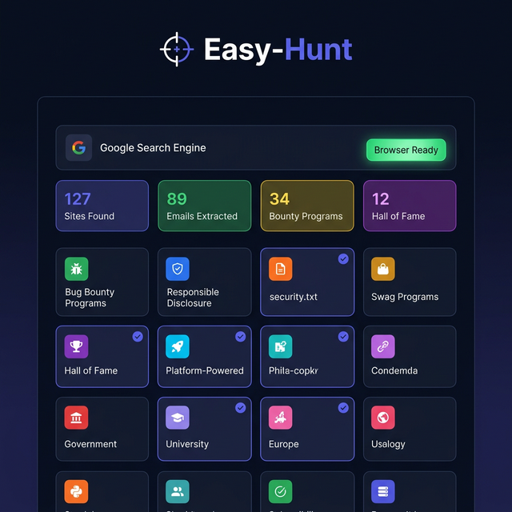
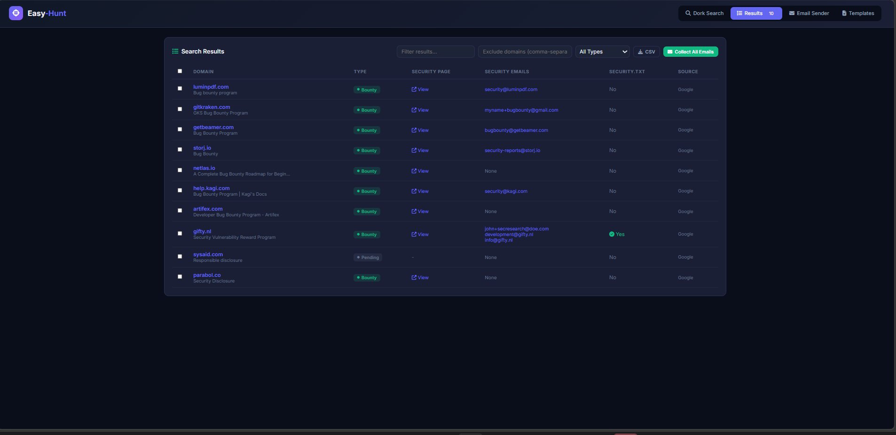
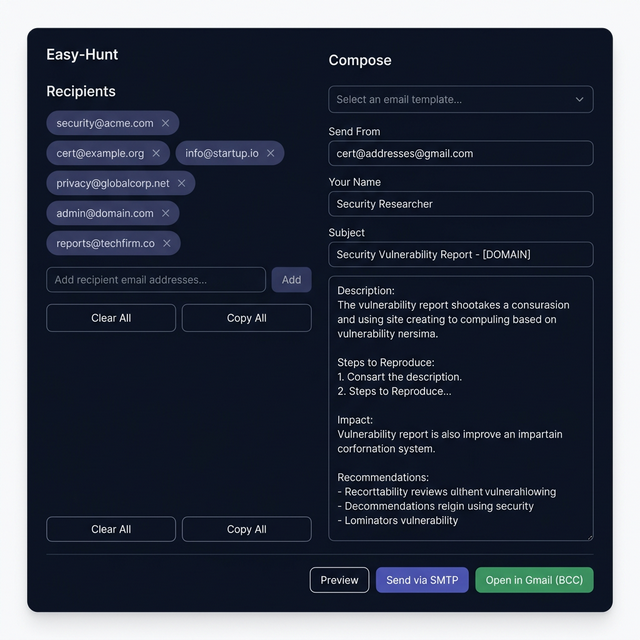

<div align="center">

# 🎯 Easy-Hunt

### Smart Bug Bounty Reconnaissance & Outreach Tool

[](https://opensource.org/licenses/MIT)
[](https://nodejs.org/)
[](https://expressjs.com/)
[](https://pptr.dev/)
[](#-docker)

<br>

**Stop wasting hours finding bug bounty targets manually.**
Easy-Hunt automates the entire recon → extract → outreach pipeline.

Find programs → Extract security contacts → Send reports → Track responses → Hunt smarter.

<br>

[🚀 Quick Start](#-quick-start) · [🐳 Docker](#-docker) · [☁️ VPS Deploy](#%EF%B8%8F-vps-deployment) · [📖 How It Works](#-how-it-works) · [⚙️ Configuration](#%EF%B8%8F-configuration)

</div>

---

## ✨ Features

<table>
<tr>
<td width="50%">

### 🔍 Smart Google Dorking
- **200+ built-in dorks** across 15 categories
- Per-dork or total result modes
- Custom dork input support
- Persistent pagination (up to 50 pages/dork)
- CAPTCHA detection & manual solve support

</td>
<td width="50%">

### 📧 Intelligent Extraction
- Visits **exact Google URL** first (not just domain)
- `security.txt` auto-detection
- Email extraction with junk/fake filtering
- Program type detection (Bounty/Swag/HoF/VDP)
- Confidence scoring for accuracy

</td>
</tr>
<tr>
<td>

### ✉️ Bulk Email Outreach
- **One-click Gmail BCC** — opens compose with all emails
- SMTP direct sending with delay
- 3 built-in report templates
- Junk email auto-filtering

</td>
<td>

### 📊 Results & Export
- Live results during search
- Filter by program type
- CSV export
- Stop/resume with partial results saved

</td>
</tr>
</table>

---

## 🖥️ Screenshots

<div align="center">

### Dork Search Panel
> Select from 15 categories with 200+ dorks, set per-dork limits, launch the browser, and start hunting.



### Live Results
> Watch results stream in real-time as each dork is processed. See domain, type, security page, and emails instantly.



### Email Sender
> Paste or collect emails → Choose template → Open in Gmail with BCC or send via SMTP.



</div>

---

## 🚀 Quick Start

### 🪟 Windows

```powershell
git clone https://github.com/Sw4pn33/Easy-Hunt.git
cd Easy-Hunt
npm install
copy .env.example .env        # optional — edit for SMTP
npm start
```

### 🐧 Linux / macOS

```bash
curl -fsSL https://deb.nodesource.com/setup_18.x | sudo -E bash -
sudo apt install -y nodejs google-chrome-stable

git clone https://github.com/Sw4pn33/Easy-Hunt.git
cd Easy-Hunt
npm install
cp .env.example .env
npm start
```

### 📱 Termux (Android)

```bash
pkg update && pkg upgrade
pkg install nodejs git chromium
npm config set puppeteer_skip_chromium_download true

git clone https://github.com/Sw4pn33/Easy-Hunt.git
cd Easy-Hunt
npm install
export PUPPETEER_EXECUTABLE_PATH=$(which chromium-browser)
cp .env.example .env
npm start
```

**Open** → `http://localhost:4500` 🎉

**Requirements:** Node.js 18+ and Google Chrome/Chromium

> | Platform | Browser | Status |
> |----------|---------|--------|
> | 🪟 Windows 10/11 | Chrome | ✅ Full support |
> | 🐧 Ubuntu / Debian / Kali | Chrome / Chromium | ✅ Full support |
> | 🍎 macOS | Chrome | ✅ Full support |
> | 📱 Termux (Android) | Chromium (headless) | ⚠️ No visible browser |

---

## 🐳 Docker

```bash
# Build and run
docker build -t easy-hunt .
docker run -d -p 4500:4500 --name easy-hunt easy-hunt

# With SMTP config
docker run -d -p 4500:4500 \
  -e SMTP_HOST=smtp.gmail.com \
  -e SMTP_PORT=587 \
  -e SMTP_USER=you@gmail.com \
  -e SMTP_PASS=your_app_password \
  -e SMTP_FROM=you@gmail.com \
  easy-hunt
```

Open `http://localhost:4500`

> **Note:** Docker runs in headless mode — dorking and extraction work fully, but CAPTCHAs can't be solved manually. For CAPTCHA support, use the native install.

---

## ☁️ VPS Deployment

Works on any Ubuntu/Debian VPS (1GB+ RAM recommended).

### Option 1: Docker (Recommended)

```bash
curl -fsSL https://get.docker.com | sh

git clone https://github.com/Sw4pn33/Easy-Hunt.git
cd Easy-Hunt
docker build -t easy-hunt .
docker run -d -p 4500:4500 --restart unless-stopped --name easy-hunt easy-hunt
```

### Option 2: Native with PM2

```bash
curl -fsSL https://deb.nodesource.com/setup_18.x | sudo -E bash -
sudo apt install -y nodejs chromium-browser

git clone https://github.com/Sw4pn33/Easy-Hunt.git
cd Easy-Hunt
npm install
export HEADLESS=true
export PUPPETEER_EXECUTABLE_PATH=$(which chromium-browser)

npm i -g pm2
pm2 start server.js --name easy-hunt
pm2 save && pm2 startup
```

Access at `http://YOUR_VPS_IP:4500`

<details>
<summary>🔒 Nginx + SSL (optional — for custom domain)</summary>

```nginx
server {
    listen 80;
    server_name hunt.yourdomain.com;

    location / {
        proxy_pass http://127.0.0.1:4500;
        proxy_set_header Host $host;
        proxy_set_header X-Real-IP $remote_addr;
    }
}
```

Then: `sudo certbot --nginx -d hunt.yourdomain.com` for free SSL.

</details>

---

## 📖 How It Works

1. **Launch Browser** 🌐 — Click "Launch Browser", solve CAPTCHA once if it appears
2. **Select Dorks & Search** 🔍 — Pick categories or enter custom dorks, set result limits
3. **Watch Live Results** 📊 — Results stream in real-time with deduplication
4. **Auto Extraction** 🔬 — Visits each URL, checks `security.txt`, extracts emails with confidence scoring
5. **Send Outreach** ✉️ — Collect emails → Pick template → Gmail BCC or SMTP bulk send

---

## 🗂️ Dork Categories

| Category | Dorks | Description |
|----------|-------|-------------|
| 🐛 Bug Bounty Programs | 30 | Monetary reward programs |
| 🛡️ Responsible Disclosure | 24 | VDP policies & reporting pages |
| 📄 security.txt Files | 18 | RFC 9116 security contacts |
| 🎁 Swag Programs | 12 | Merchandise/swag rewards |
| 🏆 Hall of Fame | 12 | Researcher acknowledgment |
| 🖥️ Platform-Powered | 13 | Bugcrowd/HackerOne powered |
| 🏛️ Government & Military | 12 | .gov and .mil programs |
| 🎓 University & Education | 9 | .edu security programs |
| 🇪🇺 Europe | 19 | European programs |
| 🌏 Asia & Pacific | 6 | APAC region |
| 🌎 Americas | 4 | North/South America |
| 💰 Fintech & Crypto | 13 | Financial & blockchain |
| 🛒 E-commerce & Payments | 4 | Shopping platforms |
| 💻 CMS & Open Source | 11 | Open source projects |
| 🔬 Advanced & Unique | 12 | Creative & uncommon dorks |

**Total: 200+ unique Google dorks**

---

## ⚙️ Configuration

Create `.env` in root (optional — only needed for SMTP):

```env
PORT=4500
HEADLESS=false                     # Set true for VPS/Docker

SMTP_HOST=smtp.gmail.com
SMTP_PORT=587
SMTP_USER=your_email@gmail.com
SMTP_PASS=your_app_password        # Google App Password, not account password
SMTP_FROM=your_email@gmail.com
```

> **Gmail App Password:** Google Account → Security → 2-Step Verification → App Passwords → Generate for "Mail"

---

## 📁 Project Structure

```
Easy-Hunt/
├── server.js              # Express server entry point
├── Dockerfile             # Docker container config
├── package.json           # Dependencies and scripts
├── .env                   # Environment configuration
├── public/
│   ├── index.html         # Main UI
│   ├── css/style.css      # Dark theme styles
│   └── js/app.js          # Frontend logic
└── src/
    ├── dorks.js           # 200+ Google dork templates
    ├── routes/
    │   ├── search.js      # Search API endpoints
    │   └── email.js       # Email sending endpoints
    └── utils/
        ├── searchEngine.js  # Puppeteer Google search engine
        └── extractor.js     # Security info extraction pipeline
```

---

## ⚠️ Disclaimer

This tool is for **authorized security research** and **responsible disclosure** only. It performs Google dorking and pattern matching — **not AI-powered**, no guarantee of accuracy. Always verify results manually before sending reports.

Users must comply with Google's ToS, applicable laws, and each organization's disclosure policy. The author is not responsible for misuse.

---

## 📄 License

MIT — see [LICENSE](LICENSE)

---

<div align="center">

**Made with ❤️ for the bug bounty community**

⭐ Star this repo if you find it useful!

[Report Bug](https://github.com/Sw4pn33/Easy-Hunt/issues) · [Request Feature](https://github.com/Sw4pn33/Easy-Hunt/issues)

</div>
